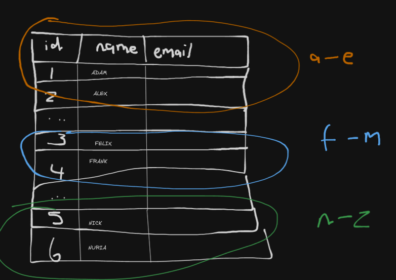

## Sharding and Partitioning

## Table of Contents
- [Sharding and Partitioning](#sharding-and-partitioning)
- [Table of Contents](#table-of-contents)
- [Purpose](#purpose)
- [How it Works](#how-it-works)
  - [Vertical Partitioning](#vertical-partitioning)
  - [Horizontal Partitioning (Sharding)](#horizontal-partitioning-sharding)
  - [Consistent hashing](#consistent-hashing)
- [Trade-offs](#trade-offs)
  - [Pros](#pros)
  - [Cons](#cons)
- [Real-World Examples](#real-world-examples)
- [Diagram](#diagram)

## Purpose
When data grows too large for a single server, **partitioning** (splitting data into pieces) is used
- **Vertical Partitioning** &rightarrow; split by columns/attributes
- **Horizontal Partitioning (Sharding)** &rightarrow; split by rows/records across servers
- **Goal**: scalability & performance by distributing load

## How it Works
### Vertical Partitioning
- Split the table columns into different servers
- *Example: In `Users`, put basic profile info on one server and detailed logs on another*
- Good for reducing row "width."
### Horizontal Partitioning (Sharding)
- Split rows/records of a table across servers
- *Example: Users A-M on Server 1, N-Z on Server 2*
- Each shard holds a subset of rows
### Consistent hashing
- Technique used to assign data to servers evenly
- Hash(key) &rightarrow; determines shard location
- If servers are added/removed, only part of the data needs to move (not everything)

## Trade-offs
### Pros
- Distributes load and storage
- Enables scaling beyond single server limits
- Reduces contention on tables with hot-spots
### Cons
- Adds complexity to schema and queries
- Cross-shard joins/transactions are harder
- Rebalancing is needed when adding/removing servers

## Real-World Examples
- **Twitter** &rightarrow; shards tweets by `user_id`
- **MongoDB8* &rightarrow; native sharding support**
- **Cassandra &rightarrow; distributes data using consistent hashing**

## Diagram
`diagram of horizontal sharing by post_id`
