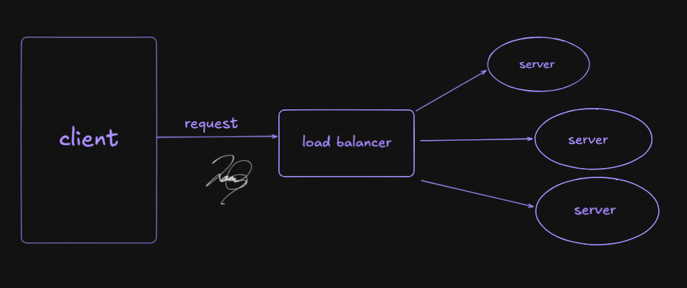

# Load Balancing
## Table of Contents
- [Load Balancing](#load-balancing)
  - [Table of Contents](#table-of-contents)
  - [Purpose](#purpose)
  - [How it Works](#how-it-works)
    - [Types of Load Balancers](#types-of-load-balancers)
      - [Layer 4 (Transport Layer: TCP/UDP)](#layer-4-transport-layer-tcpudp)
      - [Layer 7 (Application Layer: HTTP/HTTPS)](#layer-7-application-layer-httphttps)
    - [Load Balancing Algorithms](#load-balancing-algorithms)
  - [Trade-offs](#trade-offs)
    - [Pros](#pros)
    - [Cons](#cons)
  - [Real-World Examples](#real-world-examples)
  - [Diagram](#diagram)

---

## Purpose
A **load balancer** distributes incoming traffic across multiple servers to:
- **Improve performance** &rightarrow; prevent any single server from becoming a bottleneck
- **Increasing availability** &rightarrow; system keeps running even if one server fails
- **Enable horizontal scaling** &rightarrow; add more servers as traffic grows

---

## How it Works
### Types of Load Balancers
#### Layer 4 (Transport Layer: TCP/UDP)
- Routes traffic based on IP address and port
- Fast, simple, doesnt inspect application data
#### Layer 7 (Application Layer: HTTP/HTTPS)
- Routes traffic based on content (URLs, headers, cookies)
- Can do smart routing (e.g., A/B testing, session stickiness)

### Load Balancing Algorithms
- **Round Robin** &rightarrow; cycles through servers evenly
- **Least Connections** &rightarrow; sends traffic to the server with the fewest active connections
- **IP Hash** &rightarrow; routes requests from the same client IP to the same server

## Trade-offs
### Pros
- Smooths out traffic spikes
- Prevents single-server overload
- Supports rolling updates and failover

### Cons
- Adds extra network hop &rightarrow; slight latency
- Misconfigured LB can create bottlenecks
- Requires health cecks to avoid sending traffic to down servers

## Real-World Examples
- **NGINX/HAProxy** &rightarrow; Layer 7 load balancers for web apps
- **AWS ELB / ALB** &rightarrow; cloud-managed load balancers
- **CDN edge nodes** &rightarrow; also perform simple load balancing globally
*Interview case: How would you distribute traffic for a blog system with sudden spikes during viral posts?*

## Diagram
