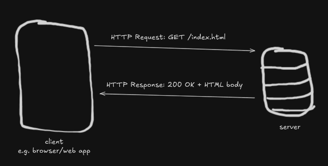

# HTTP (Basics)
`HTTP (Hypertext Transfer Protocol)`
- [HTTP (Basics)](#http-basics)
  - [Purpose](#purpose)
  - [How it Works](#how-it-works)
  - [Key Concepts](#key-concepts)
  - [Tradeoffs](#tradeoffs)
    - [Pros](#pros)
    - [Cons](#cons)
    - [When to use HTTP](#when-to-use-http)
    - [When not to use HTTP](#when-not-to-use-http)
    - [Real-World Examples](#real-world-examples)
  - [Diagram](#diagram)

## Purpose
- Standard protocol for communication on the web
- Defines how clients (e.g. browsers, apps) and servers exchange data
- Stateless, simple and widely supported &rightarrow; makes it the backbone of modern web systems.

## How it Works
- **Client-Server model**: Client sends request, server responds
- **Request structure**: (`GET`, `POST`, `PUT`, `DELETE`), headers, optional body
- **Response structure** Status code (e.g., `200 OK`, `404 Not Found`, `500 Internal Server Error`, headers, body)
- **Statelessness**: Each request is independent (no memory of past requests unless extra mechanisms like cookies/sessions are used).
- **Transport**: Typically runs over TCP (port 80 for HTTP, 443 for HTTPS with TLS).

## Key Concepts
- **Methods**: GET (read), POST (create), PUT/PATCH (update), DELETE
- **Status codes**:
  - 2xx Success
  - 3xx Redirection
  - 4xx Client errors
  - 5xx Server errors
- **Headers**: Metadata about request/response (e.g., Content-Type, Authorization, Cache-Control)
- **HTTPS**: Adds encryption and authentication via TLS (Transport Layer Security)
- **Persistent connections (HTTP/1.1)**: Keep-alive allows reuse of connections
- **HTTP/2 & HTTP/3**: Multiplexing, header compression, QUIC protocol for speed

## Tradeoffs
### Pros
- Universal, simple, human readable
- Stateless, easier to scale
- Flexible for many data types (JSON, HTML, binary, etc)
- Massive ecosystem support
### Cons
- Statelessness &rightarrow; requires extra mechanisms for sessions
- Text-based &rightarrow; larger overhead compared to binary encoded protocols
- Latency from multiple round trips (improved in HTTP/2, HTTP/3)
### When to use HTTP
- Standard for web-based communication (e.g. APIs, browsers)
- Good for distributed systems where simplicity and interoperability matter
### When not to use HTTP
- when real-time response is preferred (use WebSockets, gRPC, or raw TCP, UDP instead)
- when bandwidth is critical and overhead must be minimized
### Real-World Examples
- **Browsers**: Chrome, Firefox use HTTP for all page loads
- **APIs**: REST APIs (e.g. Twitter, GitHub)
- **CDNs**: Cached assets are delivered via HTTP/HTTPS e.g. (Cloudflare)
- **Microservices**: Many services communicate over HTTP/REST or gRPC

## Diagram
